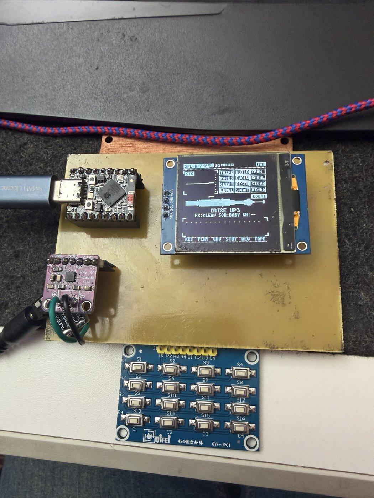

# SPEAK//HARD



A handheld speech beat machine on an ESP32-S3. Four instruments (SAM voice, Talkie LPC voice, bytebeat, a 12-piece drum kit) on a 16-step sequencer, seven voice FX plus stutter/reverse/tape-stop/scratch, and a live HUD on a 128x128 OLED.

Co-created by Mark Hellar and Claude (Anthropic AI): hardware, design and sound direction by Mark; firmware and PCB layout co-written with Claude. PCB milled and soldered by Mark Hellar.

## Hardware

| Part | Notes |
|---|---|
| ESP32-S3 SuperMini | 4 MB flash, 2 MB PSRAM (PSRAM is required) |
| 1.5" SH1107 128x128 I2C OLED | header order VCC GND SCL SDA |
| MAX98357A I2S amp breakout + small speaker | VIN from 5V |
| 4x4 tact keypad module (QYF-JP01) | passive matrix, mounts on edge pads off the bottom edge |
| Pot module (optional) | edge pads on the right edge; not used by this firmware |

### Pins

| Function | GPIO |
|---|---|
| OLED SDA / SCL | 9 / 8 |
| Keypad rows R1-R4 | 2, 3, 4, 5 |
| Keypad columns C1-C4 | 6, 7, 13, 12 |
| Amp LRC / BCLK / DIN | 1 / 44 / 43 |
| Pot wiper / pot high leg (driven HIGH) | 10 / 11 |

### PCB

Single-sided, all copper on B.Cu, designed for CNC isolation milling on a 100 x 70 mm copper-clad blank. Modules plug into female headers; the keypad and pot modules lie on SMD edge pads with their right-angle pins.

- `hardware/` KiCad 10 project (schematic, PCB, symbol library, `ks_cnc.pretty` footprints)
- `hardware/cnc/` Gerbers (B.Cu, Edge.Cuts), PTH/NPTH drills, a 1:1 fit-test PDF, and ready-made GRBL G-code:
  `1_isolation_0.1vbit.nc` (0.1 mm 20 deg V-bit, Z -0.05) -> `2_holes_1.0drill.nc` -> `3_mounting_2.0drill.nc` -> `4_outline_score_0.1vbit.nc`.
  `load_and_mirror.tcl` regenerates the G-code in FlatCAM (mirrored, since the copper is on the bottom);
  `fix_drill_spinup.py` patches drill files for GRBL laser mode. See `CNC_CHEATSHEET.txt`.

Print `PRINT_1to1_fit_test.pdf` and check your modules against it before milling: the OLED, keypad and pot outlines were measured from photos and typical specs.

## Firmware

`firmware/speakbeat_hard/` is the instrument. `firmware/keypad_bringup/` is a quick test (keys play notes, OLED grid).

Build with the Arduino IDE or arduino-cli:

- ESP32 Arduino core 3.x (tested on 3.3.5)
- Board: ESP32S3 Dev Module, USB CDC On Boot: Enabled, PSRAM: enabled
- Library: U8g2. esp-dsp ships with the ESP32 core.

```
arduino-cli compile --fqbn "esp32:esp32:esp32s3:CDCOnBoot=cdc,PSRAM=enabled" firmware/speakbeat_hard
arduino-cli upload  --fqbn "esp32:esp32:esp32s3:CDCOnBoot=cdc,PSRAM=enabled" -p <port> firmware/speakbeat_hard
```

If the board sits silent after an upload, press RST: on the SuperMini the auto-reset can leave it in the bootloader.

Audio runs at 22.05 kHz in a task on core 0 (it also scans the keypad); the display loop runs on core 1.

## Controls

The left keypad column holds the modifiers; the other 12 keys are pads.

```
[MODE ] [ pad 0 ] [ pad 1 ] [ pad 2 ]
[FX   ] [ pad 3 ] [ pad 4 ] [ pad 5 ]
[SEQ  ] [ pad 6 ] [ pad 7 ] [ pad 8 ]
[SHIFT] [ pad 9 ] [ pad 10] [ pad 11]
```

Tap a modifier for its quick action. Hold it and the screen shows what the 12 pads do while it's held.

| Modifier | Tap | Hold + pad 0..11 |
|---|---|---|
| MODE | next mode | SAM, TALK, BYTE, DRUM, VOL-, VOL+, BANK, voices ROBOT / SAM / ELF / E.T. / BRUTE |
| FX | next FX | CLEAN, CRUSH, ECHO, GRAIN, SWARM, VOX, MEGA, then momentary STUTTER, REVERSE, TAPE, UNDER, and scratch style |
| SEQ | REC on/off | REC, PLAY, GROOVE, AUTO, BPM-, BPM+, MUTATE, CHORDS, CLR VOX, CLR DRM, CLR BYT, CLR ALL |
| SHIFT | PLAY/STOP | per mode, see below |

| Mode | Pads | SHIFT + pad |
|---|---|---|
| SAM | 12 words; tap = say, hold = scratch | scratch the word |
| TALK | 12 LPC words, 4 banks (LIFTOFF, SKY, MATH, PHONETIC); tap = say, hold = scrub the frames | WHISPER, MONO, FREEZE, STRETCH, PITCH-, PITCH+, PITCH 0, GLITCH, BACKWARD, FORMANT-, FORMANT+, RESET |
| BYTE | 12 bytebeat formulas; tap = latch, hold = momentary | RATE/2, RATE*2, A-, A+, B-, B+, SYNC, STOP, CRUSH, REVERSE, RANDOM, RESET |
| DRUM | KICK SNARE CLAP HAT / OPEN 808 ANVIL PIPE / SLAM ZAP CRASH CHUG; tap = hit, hold = roll | mute that drum |

With REC on, everything you play is quantized into the 16 steps. It boots stopped with an empty pattern.

### Sound engine

- SAM words are pre-rendered into PSRAM, so they can be scratched, stuttered and granulated.
- Talkie words are decoded to LPC frames at boot and resynthesized live through the 10-pole lattice filter, so pitch, formant, voicing and coefficients can be bent while it talks.
- VOX is a 16-band vocoder (esp-dsp biquads) with SAM as the modulator and a driven polyBLEP chord carrier. Chord sets: DROP, DREAD, EPIC, MACHINE.
- Drums are synthesized: driven sine kick with a click, metal snare, multi-burst clap, 808-style hats from six detuned square waves, FM clangs, and CHUG, a fuzz power chord that follows the chord progression.
- Kick, 808 and SLAM duck the voices; a soft compressor and a 40 Hz highpass sit on the master.
- `tools/drumsim.py` is a Python port of the drum engine that prints each hit's level; run it after changing the `PERC[]` table.

## Credits

- **SAM** (Software Automatic Mouth, Don't Ask Software, 1982). C port by Sebastian Macke; ESP8266SAM by Earle Philhower.
- **Talkie** by Peter Knight; vocabularies converted by Armin Joachimsmeyer. LPC tables and lattice filter via ESP8266Audio's AudioGeneratorTalkie.
- **esp-dsp** by Espressif.
- **U8g2** by olikraus.
- **Bytebeat** formulas from the viznut (2011) bytebeat scene.

Details in [THIRD_PARTY.md](THIRD_PARTY.md).

## License

GPL v3. See [LICENSE](LICENSE).
